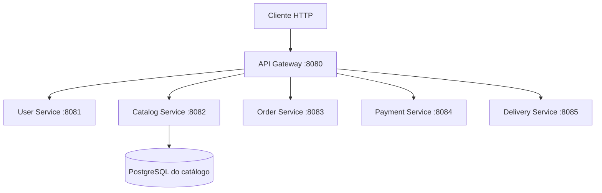
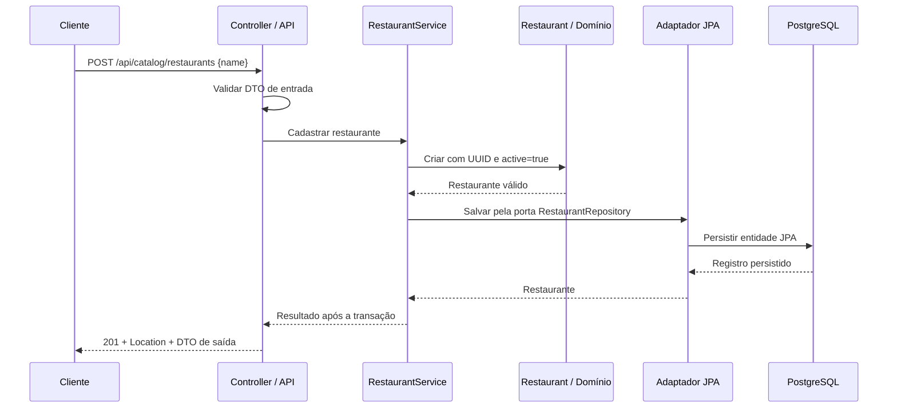

# Arquitetura do Delivery Order System

## Implementado nesta etapa

Monorepo com seis aplicações Spring Boot executadas separadamente. Cada aplicação tem seu próprio build Maven, configuração e testes. Nenhum serviço depende do código Java de outro serviço.

O Catalog Service cadastra e consulta restaurantes em seu próprio PostgreSQL. Os demais serviços mantêm a base inicial, com endpoints de demonstração e Actuator, sem persistência ou regras de negócio.

O Gateway utiliza Spring Cloud Gateway Server WebFlux. Os cinco serviços utilizam Spring MVC. As rotas são estáticas e apontam para `localhost`, pois as aplicações são executadas diretamente na máquina nesta etapa. O Compose sobe somente o PostgreSQL do catálogo.

## Responsabilidades e contratos

As responsabilidades abaixo definem os limites de cada aplicação. No catálogo, somente cadastro e consultas de restaurantes estão implementados; cardápios, produtos, preços e disponibilidade continuam planejados.

| Aplicação | Responsabilidade | Porta | Rota pelo Gateway | Pacote-base |
| --- | --- | --- | --- | --- |
| API Gateway | Encaminhar chamadas HTTP, sem regras de negócio | 8080 | — | `com.victhor.delivery.gateway` |
| User Service | Perfis de usuários e endereços | 8081 | `/api/users/**` | `com.victhor.delivery.user` |
| Catalog Service | Restaurantes, cardápios, produtos, preços e disponibilidade | 8082 | `/api/catalog/**` | `com.victhor.delivery.catalog` |
| Order Service | Pedidos, itens, totais, estados e coordenação da compra | 8083 | `/api/orders/**` | `com.victhor.delivery.order` |
| Payment Service | Tentativas de pagamento, aprovação, recusa e estorno | 8084 | `/api/payments/**` | `com.victhor.delivery.payment` |
| Delivery Service | Atribuição de entregador, coleta e estados da entrega | 8085 | `/api/deliveries/**` | `com.victhor.delivery.delivery` |

Cada serviço mantém `GET /api/{recurso}/ping`, respondendo HTTP 200 com `{"service":"<nome-do-serviço>","status":"ok"}`. O Gateway encaminha o caminho completo, sem remover prefixos. A rota `/api/catalog/**` atende também `/api/catalog/restaurants` e suas consultas, sem regras de negócio no Gateway.

Todas as aplicações mantêm `/actuator/health` e `/actuator/info`. O health do Gateway mede sua própria saúde; a disponibilidade dos serviços precisa ser verificada separadamente. O catálogo inclui a saúde do banco em seu próprio endpoint.

## Organização do catálogo

A classe `CatalogServiceApplication` permanece no pacote-base para a descoberta dos componentes Spring. A separação de responsabilidades agora acompanha o primeiro caso de uso:

| Pacote | Responsabilidade |
| --- | --- |
| `api` | Controllers, DTOs de entrada e saída, validação HTTP, paginação recebida e respostas de erro |
| `application` | `RestaurantService` coordena os casos de uso; `RestaurantRepository` define a porta de persistência e `RestaurantPage` representa uma página, sem dependências de Spring ou JPA |
| `domain` | `Restaurant` representa UUID, nome e estado ativo, aplicando as invariantes sem depender de HTTP, Spring ou JPA |
| `infrastructure.persistence` | Entidade JPA, repositório Spring Data e adaptador que implementa a porta, delimita as transações e converte entre o modelo de domínio e o de persistência |

O domínio não contém anotações JPA ou de validação HTTP. A entidade JPA não é exposta na API. DTOs controlam o contrato público, e o adaptador concentra o mapeamento de persistência. Não há um framework genérico de casos de uso ou repositórios: uma porta específica do restaurante é suficiente.

`RestaurantConfiguration`, em `infrastructure`, fornece o serviço de aplicação como bean Spring e injeta o adaptador. `JpaRestaurantRepository` abre uma transação de escrita no cadastro e transações de leitura nas consultas. O cadastro só retorna depois da confirmação da transação. Cada caso de uso atual faz uma chamada de persistência; um fluxo futuro com várias gravações relacionadas precisará de uma transação que englobe a operação inteira.

Os outros serviços continuam com a classe `*Application` no pacote-base e controllers em `api`. Novas camadas serão criadas quando houver código que as justifique. O Gateway mantém organização própria para configuração e filtros.

## Fluxo de cadastro e consulta

O controller recebe o JSON, valida a entrada e chama o caso de uso. O serviço de aplicação cria o restaurante por meio do domínio e solicita sua persistência. O domínio remove espaços nas extremidades do nome, exige um nome não vazio de até 120 caracteres e gera o UUID com `active=true` para um cadastro. O adaptador converte o restaurante para a entidade JPA e salva no PostgreSQL. Ao retornar, o controller monta o DTO com `id`, `name` e `active`, status `201` e `Location: /api/catalog/restaurants/{id}`. O endereço relativo funciona tanto pela porta 8082 quanto pelo Gateway na porta 8080.

Na consulta por UUID, o controller converte o identificador e o caso de uso busca pela mesma porta de persistência. Um resultado vira DTO com `200`; a ausência vira erro `404`. UUID malformado é entrada inválida (`400`).

Na listagem, a API valida `page` e `size`, o caso de uso solicita a página, e o adaptador executa a consulta e a contagem. A resposta contém `content`, `page`, `size`, `totalElements` e `totalPages`, sem expor a representação interna de paginação do Spring Data.

## Contrato de restaurantes

| Operação | Entrada | Resposta de sucesso |
| --- | --- | --- |
| `POST /api/catalog/restaurants` | JSON com `name` obrigatório, até 120 caracteres | `201`, `Location` e `{id, name, active}` |
| `GET /api/catalog/restaurants/{id}` | UUID | `200` e `{id, name, active}` |
| `GET /api/catalog/restaurants?page=0&size=20` | Página e tamanho opcionais | `200` e `{content, page, size, totalElements, totalPages}` |

`page` começa em zero e deve ser não negativo. `size` fica entre 1 e 100, com padrão 20. O produto `page * size` deve caber no offset do JPA (máximo `2147483647`). A ordenação é fixa por nome ascendente e UUID ascendente como desempate; nomes repetidos são permitidos. Uma página sem registros possui `content` vazio. A ordenação é determinística para o mesmo conjunto de dados; alterações concorrentes podem mudar o conteúdo de páginas consultadas em momentos diferentes.

Não há atualização, exclusão ou desativação nesta etapa. O cliente não escolhe o UUID nem o estado inicial do cadastro.

Os erros HTTP são padronizados como `ProblemDetail`, com tipo de mídia `application/problem+json` e campos `status`, `title` e `detail`. Podem incluir `type` e `instance`. Entrada inválida, JSON malformado, UUID inválido ou paginação inválida retornam `400`; restaurante inexistente retorna `404`. Falhas inesperadas retornam `500` com mensagem genérica, sem SQL, stack trace ou outras informações internas.

## Persistência e execução local

O catálogo usa Spring Data JPA e driver PostgreSQL. Flyway controla a evolução do schema em `services/catalog-service/src/main/resources/db/migration`; a migration inicial cria a tabela de restaurantes com UUID, nome obrigatório e indicador ativo. O índice por `(name, id)` acompanha a ordem de consulta. As versões das dependências são geridas pelo Spring Boot 4.1.1 existente, incluindo o starter Flyway e o módulo PostgreSQL do Flyway.

Na inicialização, Flyway aplica as migrations pendentes e Hibernate valida o mapeamento com `spring.jpa.hibernate.ddl-auto=validate`. Não há criação ou atualização automática do schema pelo Hibernate. `spring.jpa.open-in-view=false` mantém o acesso ao banco dentro da camada de aplicação/persistência, antes da montagem da resposta HTTP.

`compose.yaml` contém somente `catalog-db`, com imagem `postgres:17-alpine`, banco `catalog`, volume nomeado `catalog_postgres_data` e health check `pg_isready`. A porta é publicada em `127.0.0.1`, usando 5432 por padrão. As aplicações Java continuam executadas na máquina, fora do Compose.

`.env.example` documenta `CATALOG_DB_URL`, `CATALOG_DB_USERNAME`, `CATALOG_DB_PASSWORD` e `CATALOG_DB_PORT`, com valores apenas locais. A cópia `.env` não é versionada. A senha é obrigatória; o Spring importa o arquivo do diretório de execução, e o comando de desenvolvimento no README fixa esse diretório na raiz. Variáveis de ambiente também podem fornecer a configuração. Se a porta estiver ocupada, `CATALOG_DB_PORT` e a porta da URL JDBC devem ser ajustadas juntas.

Dados do volume sobrevivem a reinícios. Credenciais definidas pelo container inicializam um banco vazio, mas não reconfiguram um volume já existente. Execução e testes não exigem remover volumes ou dados locais. Cada serviço continuará sendo dono de seus dados; serviços não consultarão tabelas de outros serviços.

## Testes e validação

Os testes do domínio verificam as invariantes do restaurante sem subir Spring ou banco. Os testes de integração do catálogo usam PostgreSQL 17 real via Testcontainers, com configuração dinâmica e banco isolado do Compose. Eles inicializam o contexto, aplicam as migrations Flyway, validam o schema com Hibernate e cobrem HTTP e persistência: cadastro, UUID/estado inicial, nome, dados salvos, consulta, paginação, entrada inválida e restaurante inexistente. Pings e Actuator permanecem cobertos no catálogo.

O `contextLoads` do catálogo usa a mesma estratégia de banco descartável. A suíte completa exige Docker em execução e não ignora silenciosamente a integração quando ele está ausente. Os outros serviços e o Gateway mantêm testes de inicialização de contexto.

`clean test` executa os testes; `clean verify` também gera o JAR executável. Além da suíte do catálogo, a verificação local exercita criação e consultas nas portas 8082 e 8080, conferindo `201`, `Location`, `200`, pings e saúde. O teste HTTP direto do catálogo não substitui a validação do encaminhamento pelo processo real do Gateway.

Os comandos de configuração, execução, testes e chamadas HTTP estão no [README](../README.md).

## Planejado, ainda não implementado

- Cardápios e produtos no catálogo; persistência e regras de negócio nos demais serviços.
- RabbitMQ para comandos e eventos entre aplicações. Cada serviço acessará diretamente seu banco; o broker não ficará entre aplicação e banco.
- Order Service coordenando o fluxo de compra e compensações. Os contratos e estados serão definidos antes de implementar a saga.
- Transactional Outbox, consumidores idempotentes, confirmações, retentativas limitadas e DLQ para recuperação de falhas de mensageria.
- Autenticação e autorização, com decisão sobre provedor de identidade em etapa própria.
- Docker Compose para execução local do conjunto de aplicações. Nesse ambiente, os endereços dos serviços terão de usar os nomes da rede Docker em vez de `localhost`.
- Testcontainers para futuras integrações com RabbitMQ e testes dos fluxos entre serviços.
