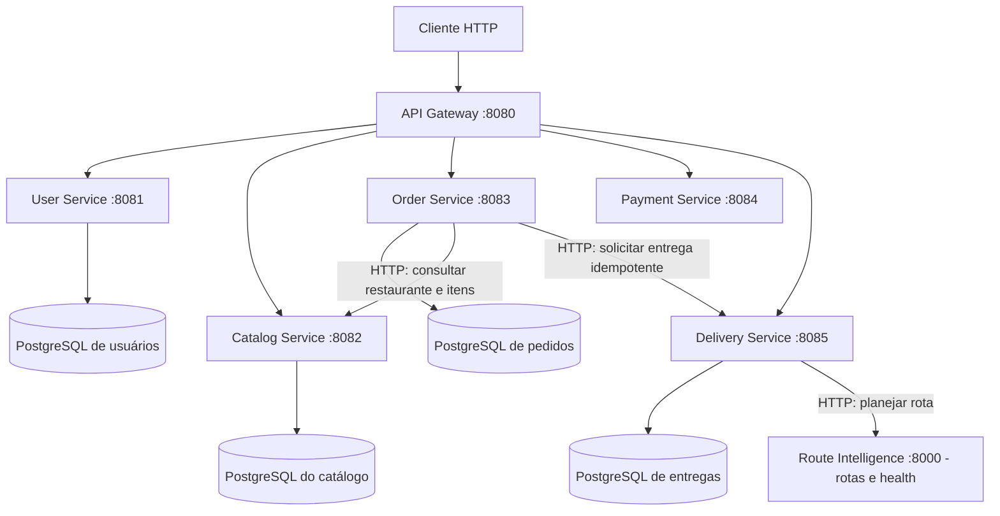
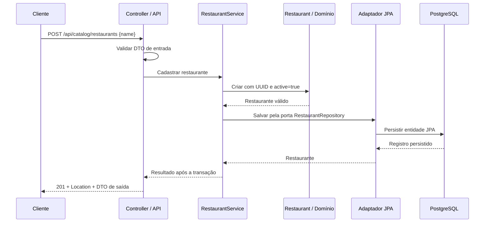

# Arquitetura do Delivery Order System

## Implementado nesta etapa

Monorepo com seis aplicações Spring Boot executadas separadamente. Cada aplicação tem seu próprio build Maven, configuração e testes. Nenhum serviço depende do código Java de outro serviço.

O monorepo também contém [Route Intelligence em Python](route-intelligence-foundation.md), com FastAPI, configuração por ambiente, dependências travadas e `/health` na porta 8000. Já calcula rotas em um [grafo sintético com custos de referência](road-graph.md) por terminal e possui [treinamento e avaliação offline de ML](route-segment-model.md). A [consulta HTTP de rotas previstas](intelligent-routing-api.md) está implementada; a [integração com Delivery](delivery-route-integration.md) também está implementada. Ele não acessa os bancos nem está conectado ao Gateway. Seu build e testes são independentes do Maven.

O pacote `training` gera e valida o [dataset sintético de tempo por trecho](route-segment-dataset.md), compara modelos, seleciona na validação e avalia o artefato no teste reservado. Também importa e [avalia os CSVs de observações do Delivery](segment-observation-evaluation.md), comparando previsões armazenadas com durações simuladas e preservando a proveniência. A [preparação dessas observações](segment-observation-dataset.md) cria outro dataset, com manifesto próprio, partições por entrega e carregamento que reconstrói a política temporal. O [treino observacional](segment-observation-training.md) reutiliza candidatos, seleção, métricas e serialização, preservando a origem `simulated` em artefatos offline próprios. A API continua carregando exclusivamente os bundles sintéticos v1. `app/ml` contém features compartilhadas, pipelines, carregamento validado e predictor em lote. Geração e treinamento não são executados no startup ou em endpoints.

O User Service mantém [perfis e endereços](user-profiles.md) e [credenciais de autenticação](authentication.md) em PostgreSQL próprio. O Catalog Service cadastra e consulta restaurantes em seu próprio PostgreSQL, incluindo a localização de coleta opcional. Essa localização também pode ser atualizada por uma operação própria. O catálogo também gerencia [itens de cardápio](restaurant-menu.md), com nome, descrição opcional, preço em BRL e disponibilidade. O Order Service consulta esses dados por HTTP para criar pedidos com [itens e preços preservados](order-items.md) em outro PostgreSQL, além de consultar, confirmar e cancelar pedidos. Delivery cria e consulta entregas e entregadores por HTTP e executa o ciclo de entrega, com persistência em banco próprio. Payment registra [tentativas de pagamento simuladas](simulated-payments.md) em banco próprio, com idempotência por cliente e chave e no máximo uma aprovação por pedido.

O Gateway utiliza Spring Cloud Gateway Server WebFlux. Os cinco serviços utilizam Spring MVC. As rotas são estáticas, com endereços configuráveis por ambiente e padrões `localhost` para execução nativa. O Compose mantém os quatro bancos com volumes separados e oferece o [perfil `demo`](route-intelligence-compose.md) para as sete aplicações, totalizando onze containers. Na rede Docker, HTTP e JDBC usam hostnames dos serviços; somente Gateway, Python e bancos publicam portas na máquina. O modelo é montado somente para leitura, e o treinamento permanece offline. As seis JVMs do perfil usam parâmetros comuns de heap (64–384 MB) e dimensionamento para dois processadores, ajustáveis por `DEMO_JAVA_TOOL_OPTIONS`; isso não altera a execução nativa nem impõe cota de CPU.

## Responsabilidades e contratos

As responsabilidades abaixo definem os limites de cada aplicação. O catálogo implementa cadastro, consultas e atualização da localização de coleta de restaurantes, além do cadastro, consultas e atualização dos itens de seus cardápios. Preços e disponibilidade atuais pertencem ao catálogo; cada pedido guarda uma cópia dos nomes e preços usados na sua criação e calcula seus próprios totais.

| Aplicação | Responsabilidade | Porta | Rota pelo Gateway | Pacote-base |
| --- | --- | --- | --- | --- |
| API Gateway | Encaminhar chamadas HTTP, sem regras de negócio | 8080 | — | `com.victhor.delivery.gateway` |
| User Service | Perfis, endereços e autenticação | 8081 | `/api/users/**` | `com.victhor.delivery.user` |
| Catalog Service | Restaurantes, cardápios, produtos, preços e disponibilidade | 8082 | `/api/catalog/**` | `com.victhor.delivery.catalog` |
| Order Service | Pedidos, itens, totais, estados e coordenação da compra | 8083 | `/api/orders/**` | `com.victhor.delivery.order` |
| Payment Service | Tentativas de pagamento, aprovação, recusa e estorno | 8084 | `/api/payments/**` | `com.victhor.delivery.payment` |
| Delivery Service | Atribuição de entregador, coleta e estados da entrega | 8085 | `/api/deliveries/**` | `com.victhor.delivery.delivery` |
| Route Intelligence | Rotas HTTP com ML, prontidão e treinamento offline | 8000 | — | `app` |

Cada serviço Java mantém `GET /api/{recurso}/ping`, respondendo HTTP 200 com `{"service":"<nome-do-serviço>","status":"ok"}`. O Gateway encaminha o caminho completo, sem remover prefixos. A rota `/api/catalog/**` atende também `/api/catalog/restaurants` e suas consultas, sem regras de negócio no Gateway.

Todas as aplicações Java mantêm `/actuator/health` e `/actuator/info`. O health do Gateway mede sua própria saúde; a disponibilidade dos serviços precisa ser verificada separadamente. Usuários, catálogo, pedidos e entregas incluem a saúde dos respectivos bancos em seus endpoints.

## Organização do catálogo

A classe `CatalogServiceApplication` permanece no pacote-base para a descoberta dos componentes Spring. Restaurantes e itens de cardápio seguem a mesma separação de responsabilidades:

| Pacote | Responsabilidade |
| --- | --- |
| `api` | Controllers, DTOs de entrada e saída, validação HTTP, paginação recebida e respostas de erro |
| `application` | `RestaurantService` e `MenuItemService` coordenam os casos de uso por portas próprias de repositório e retornam páginas de aplicação, sem dependências de Spring ou JPA |
| `domain` | `Restaurant` representa UUID, nome, estado ativo e localização opcional; `PickupLocation` valida coordenadas; `MenuItem` valida identidade, vínculo ao restaurante, textos, preço e disponibilidade |
| `infrastructure.persistence` | Entidades JPA, repositórios Spring Data e adaptadores que implementam as portas, delimitam as transações e convertem entre domínio e persistência |

O domínio não contém anotações JPA ou de validação HTTP. As entidades JPA não são expostas na API. DTOs controlam o contrato público, e os adaptadores concentram o mapeamento de persistência. Cada recurso possui sua porta específica de persistência, sem framework genérico de casos de uso ou repositórios.

`RestaurantConfiguration` e `MenuItemConfiguration`, em `infrastructure`, fornecem os serviços de aplicação como beans Spring e injetam os adaptadores. Os adaptadores JPA abrem transações de escrita no cadastro e nas atualizações, e transações de leitura nas consultas. Cada operação retorna depois da confirmação da transação. Um fluxo futuro com várias gravações relacionadas precisará de uma transação que englobe a operação inteira.

`MenuItemService` exige restaurante existente e filtra consultas e atualizações por `restaurantId` e UUID do item. O `PUT` substitui os campos editáveis na mesma transação, preserva a identidade e o restaurante e retorna `404` quando o item não pertence ao restaurante informado. Atualizar um UUID ausente não cria um item. A disponibilidade pode ser alterada; a listagem de gestão também inclui itens indisponíveis. O preço usa `BigDecimal` com duas casas, sem arredondar frações de centavo. A moeda é BRL. Não há versionamento otimista nessa atualização: prevalece a última gravação confirmada.

Pagamentos seguem as mesmas camadas `domain`, `application`, `api` e `infrastructure` dos demais serviços. O Gateway mantém organização própria para configuração e filtros.

## Organização de usuários

User segue a mesma separação de domínio, casos de uso, API e persistência, com build independente:

| Pacote | Responsabilidade |
| --- | --- |
| `domain` | `UserProfile`, `EmailAddress`, `UserAddress` e `PasswordPolicy` validam identidade, nomes, e-mail, coordenadas e senhas sem Spring/JPA |
| `application` | `UserProfileService` e `UserAddressService` coordenam perfis/endereços por repositórios próprios; `AuthenticationService` usa portas de credenciais, hash e token; a página de endereços copia sua lista |
| `api` | Controllers e DTOs de perfis/endereços/autenticação, validação JSON, configuração de segurança e erros HTTP com `ProblemDetail` |
| `infrastructure.persistence` | Entidades, repositórios Spring Data e adaptadores JPA delimitam transações e preservam os campos de identidade |
| `infrastructure.auth` | BCrypt, emissão/validação JWT, relógio e configuração dos beans de autenticação |

`UserConfiguration` fornece os beans de aplicação. O cadastro gera UUID e normaliza o e-mail inteiro para minúsculas com `Locale.ROOT`; formato ASCII e limites são validados no domínio. Atualizar o perfil substitui somente o nome, preservando UUID e e-mail. E-mail imutável e UUID estável preparam o vínculo com credenciais futuras sem incluir autenticação no domínio dos endereços.

Um endereço pertence a um usuário e contém rótulo, descrição textual e coordenadas explícitas. Criação e listagem verificam se o usuário existe. Consulta e atualização filtram pelo par `userId + addressId`; um endereço de outro usuário retorna `404`. O `PUT` substitui seus campos editáveis na mesma transação e preserva os UUIDs. Não há versão/ETag nessas atualizações: prevalece a última gravação confirmada, como no cardápio.

`V1__create_users_and_addresses.sql` cria `users` e `user_addresses` no banco próprio. A FK fica restrita a esse banco; o índice `(user_id, label, id)` atende a paginação ordenada. A constraint `users_email_unique` garante unicidade do e-mail normalizado inclusive entre cadastros simultâneos. O adaptador faz flush e traduz especificamente essa violação para `409`, sem classificar outras falhas de integridade como duplicidade.

Não há login, confirmação de e-mail, senha ou vínculo com Orders nesta etapa. Filtrar endereços pelo usuário informado organiza os dados, mas não comprova a identidade de quem faz a chamada. Autenticação e autorização terão contratos próprios. Alterar um endereço não modifica os destinos já preservados nos pedidos. Veja o [contrato de perfis e endereços](user-profiles.md).

## Domínio de entregas

O pacote `domain` de Delivery contém `Delivery`, `DeliveryStatus`, `DeliveryLocation`, `GeoPoint` e a identidade mínima de `Courier`. Não depende de Spring, HTTP, JPA ou código de outros serviços. `Delivery` encapsula suas alterações em comandos; origem e destino são valores imutáveis.

O ciclo é `CREATED → ASSIGNED → PICKED_UP → IN_TRANSIT → DELIVERED`, com cancelamento apenas antes da coleta. A chegada é um evento durante `IN_TRANSIT` e precisa ser registrada antes da conclusão. Os comandos recebem `Instant`, rejeitam horários anteriores ao último evento e preservam os dados quando uma validação falha. Comandos repetidos e alterações em estados terminais são rejeitados.

A atribuição exige um entregador ativo, carregado do banco pelo adaptador. Um índice único parcial impede duas entregas em andamento para o mesmo entregador, e outra restrição garante uma entrega por pedido. `@Version` protege atualizações da mesma entrega. O [documento do domínio](delivery-domain.md) detalha as regras; a [documentação de persistência](delivery-persistence.md) explica schema, transações e testes.

As portas de repositório ficam em `application`, e as entidades e adaptadores em `infrastructure.persistence`. Cada transição lê a entidade, reconstrói o domínio com `Delivery.restore`, aplica o comando e grava o estado na mesma transação. O domínio permanece independente de JPA. Os serviços de aplicação coordenam os comandos e recebem um `Clock` UTC para horários com precisão de microssegundos. Controllers e DTOs em `api` expõem os comandos, sem expor entidades JPA. A API traduz recurso ausente para `404`, entrada inválida para `400`, conflitos de estado/unicidade/versão para `409` e erros inesperados para `500` com mensagem genérica. O [contrato de entregas](delivery-lifecycle.md) detalha os endpoints e as limitações.

O [planejamento de rotas](delivery-route-integration.md) usa `DeliveryRouteService` e a porta `RouteOptimizer`, com tipos Java puros. A chamada HTTP ocorre entre a leitura do snapshot e uma transação curta de gravação. O plano em JSONB é salvo junto ao incremento condicional da versão da entrega; concorrência rejeita resultados obsoletos. O ciclo e seus timestamps permanecem intactos.

## Pedidos

O pedido contém UUID, referência ao restaurante, endereço e coordenadas de destino, itens com nomes/preços preservados, quantidades, total, estado e horários do ciclo de vida. O destino e a composição são cópias imutáveis: mudanças futuras no endereço de um usuário ou no cardápio não alteram pedidos já criados. `CREATED` pode passar para `CONFIRMED` ou `CANCELLED`; `CONFIRMED` pode passar para `CANCELLED` enquanto não houver intenção de entrega. Um cancelamento impede nova confirmação. Confirmar ou cancelar novamente mantém o resultado anterior.

`Order`, `DeliveryDestination`, `OrderItem` e `OrderPricing`, em `domain`, validam os dados e as transições sem depender de Spring, JPA ou HTTP. `OrderItem` preserva UUID do item, nome, quantidade e preço unitário e deriva `lineTotal`. `OrderPricing` exige de 1 a 50 itens distintos, calcula o total com `BigDecimal` e valida o total restaurado do banco. A moeda é BRL. `OrderService`, em `application`, coordena as operações por portas de persistência e consulta do catálogo e recebe um `Clock` para gerar horários testáveis. O controller converte DTOs em dados do domínio; o adaptador JPA lê o pedido, aplica sua transição e salva o estado na mesma transação. A resposta usa um DTO e só retorna após a confirmação da transação.

`OrderEntity` usa `@Version` para impedir que uma escrita baseada em uma versão antiga sobrescreva outra alteração. A API traduz esse conflito para `409`; o cliente deve consultar o estado atual. Não há repetição automática da transação. A migration também impõe limites de coordenadas, estados permitidos e consistência dos timestamps.

A API oferece cadastro, consulta por UUID, confirmação, cancelamento e solicitação de entrega em `/api/orders`. O Gateway já encaminha esse prefixo. Timestamps são instantes UTC com precisão de microssegundos, compatível com PostgreSQL. Erros seguem `ProblemDetail`, como no catálogo: entrada inválida `400`, pedido inexistente `404`, conflito `409`, dependência remota indisponível/inválida `503` e falha inesperada `500` sem detalhes internos.

O cadastro recebe `restaurantId` e uma lista de IDs e quantidades, sem preços definidos pelo cliente ou chave estrangeira entre bancos. O serviço consulta o restaurante uma vez e cada item por uma porta HTTP, exige restaurante ativo e itens disponíveis e monta os snapshots antes da transação de gravação. Uma criação com N itens usa 1 + N consultas sequenciais ao catálogo. Como as consultas são independentes, elas não fornecem um snapshot atômico do cardápio: uma atualização concorrente pode ser observada entre chamadas. Entrada inválida retorna `400`; ausência no catálogo ou indisponibilidade comercial retorna `409`; falhas HTTP, timeout ou resposta remota inválida retornam `503` com detalhe genérico. Nenhum pedido é salvo quando essas validações falham.

A migration `V3__add_order_items.sql` adiciona `orders.total` como `NUMERIC(14,2)` opcional e a tabela `order_items`. `OrderEntity` mapeia a composição como uma lista `@ElementCollection`, ordenada por `item_position`. Cada linha pertence somente ao pedido, com exclusão em cascata e sem chave estrangeira para o catálogo. O preço unitário usa `NUMERIC(10,2)`; total de linha e moeda não são colunas redundantes. Constraints limitam nomes, quantidades, preços e posições e impedem repetir um item no mesmo pedido. Os registros anteriores permanecem sem composição, respondendo com `items: []`, `total: null` e `currency: null`; seus estados, timestamps, versões e intenções de entrega são preservados. Confirmação, cancelamento e intenção de entrega alteram apenas o ciclo de vida e mantêm os itens e valores.

Ao solicitar entrega de um pedido confirmado, `OrderDeliveryService` consulta o catálogo por uma porta HTTP, exige restaurante ativo e coleta informada, persiste uma intenção e os snapshots e chama o contrato idempotente de Delivery. Não consulta novamente os itens nem recalcula preços. As chamadas remotas ocorrem fora da transação local. Depois da intenção, cancelamento é bloqueado e novas tentativas usam os dados persistidos. A V2 preserva pedidos antigos. Pagamento ainda não foi implementado. Os [exemplos de pedidos](orders.md) e o [contrato de integração](order-delivery-integration.md) detalham as regras e a recuperação de falhas.

As operações com JPA são síncronas. Não há trabalho independente que justifique `@Async` ou mensageria neste fluxo: a resposta confirma que a transação terminou. Processamento assíncrono entre serviços será avaliado junto com idempotência e entrega durável de eventos.

## Fluxo de cadastro e consulta

O controller recebe o JSON, valida a entrada e chama o caso de uso. O serviço de aplicação cria o restaurante por meio do domínio e solicita sua persistência. O domínio remove espaços nas extremidades do nome, exige um nome não vazio de até 120 caracteres e gera o UUID com `active=true` para um cadastro. O adaptador converte o restaurante para a entidade JPA e salva no PostgreSQL. Ao retornar, o controller monta o DTO com `id`, `name`, `active` e `pickupLocation`, status `201` e `Location: /api/catalog/restaurants/{id}`. O endereço relativo funciona tanto pela porta 8082 quanto pelo Gateway na porta 8080.

Na consulta por UUID, o controller converte o identificador e o caso de uso busca pela mesma porta de persistência. Um resultado vira DTO com `200`; a ausência vira erro `404`. UUID malformado é entrada inválida (`400`).

Na listagem, a API valida `page` e `size`, o caso de uso solicita a página, e o adaptador executa a consulta e a contagem. A resposta contém `content`, `page`, `size`, `totalElements` e `totalPages`, sem expor a representação interna de paginação do Spring Data.

## Contrato de restaurantes

| Operação | Entrada | Resposta de sucesso |
| --- | --- | --- |
| `POST /api/catalog/restaurants` | JSON com `name` obrigatório e `pickupLocation` opcional | `201`, `Location` e `{id, name, active, pickupLocation}` |
| `GET /api/catalog/restaurants/{id}` | UUID | `200` e `{id, name, active, pickupLocation}` |
| `GET /api/catalog/restaurants?page=0&size=20` | Página e tamanho opcionais | `200` e `{content, page, size, totalElements, totalPages}` |
| `PUT /api/catalog/restaurants/{id}/pickup-location` | UUID e JSON com `latitude` e `longitude` | `200` com o restaurante atualizado |

`page` começa em zero e deve ser não negativo. `size` fica entre 1 e 100, com padrão 20. O produto `page * size` deve caber no offset do JPA (máximo `2147483647`). A ordenação é fixa por nome ascendente e UUID ascendente como desempate; nomes repetidos são permitidos. Uma página sem registros possui `content` vazio. A ordenação é determinística para o mesmo conjunto de dados; alterações concorrentes podem mudar o conteúdo de páginas consultadas em momentos diferentes.

A localização pode ser informada ou substituída; nome e estado ativo não têm operação de atualização nesta etapa. Também não há exclusão, desativação ou remoção da localização. O cliente não escolhe o UUID nem o estado inicial do cadastro.

`PickupLocation` exige latitude e longitude finitas, nos intervalos inclusivos [-90, 90] e [-180, 180]. A API usa DTOs próprios e rejeita coordenadas ausentes ou recebidas como strings. Restaurantes antigos continuam sem localização, representada por `null`. O `PUT` altera as duas coordenadas na mesma transação, preserva os outros campos e retorna `404` quando o restaurante não existe.

Os erros HTTP são padronizados como `ProblemDetail`, com tipo de mídia `application/problem+json` e campos `status`, `title` e `detail`. Podem incluir `type` e `instance`. Entrada inválida, JSON malformado, UUID inválido ou paginação inválida retornam `400`; restaurante inexistente retorna `404`. Falhas inesperadas retornam `500` com mensagem genérica, sem SQL, stack trace ou outras informações internas.

## Persistência e execução local

O catálogo usa Spring Data JPA e driver PostgreSQL. Flyway controla a evolução do schema em `services/catalog-service/src/main/resources/db/migration`; a migration inicial cria a tabela de restaurantes com UUID, nome obrigatório e indicador ativo. O índice por `(name, id)` acompanha a ordem de consulta. As versões das dependências são geridas pelo Spring Boot 4.1.1 existente, incluindo o starter Flyway e o módulo PostgreSQL do Flyway.

A V2 adiciona as duas coordenadas como colunas opcionais, com constraints para exigir o par completo e respeitar os limites geográficos. Ela não altera a V1 nem preenche localizações nos registros existentes. Um teste com PostgreSQL migra dados da V1 para a V2 e confere essa preservação.

A V3 cria `menu_items`, com chave estrangeira para `restaurants`, sem exclusão em cascata, preço `NUMERIC(10,2)`, constraints de texto/preço e índice `(restaurant_id, name, id)` para a paginação de cada restaurante. A entidade mantém `restaurantId` como UUID, sem associação JPA ao restaurante. A migração V2→V3 preserva restaurantes e coordenadas e não inventa itens. PostgreSQL pode arredondar valores com casas excedentes ao convertê-los para `NUMERIC(10,2)`; domínio e API rejeitam frações de centavo antes da persistência.

Na inicialização, Flyway aplica as migrations pendentes e Hibernate valida o mapeamento com `spring.jpa.hibernate.ddl-auto=validate`. Não há criação ou atualização automática do schema pelo Hibernate. `spring.jpa.open-in-view=false` mantém o acesso ao banco dentro da camada de aplicação/persistência, antes da montagem da resposta HTTP.

`compose.yaml` contém `catalog-db`, `order-db`, `delivery-db`, `user-db` e `payment-db`, com imagem `postgres:17-alpine` e health check `pg_isready`. O catálogo usa banco `catalog`, volume `catalog_postgres_data` e porta padrão 5432. Pedidos usam banco `orders`, volume `order_postgres_data` e porta padrão 5434. Entregas usam banco `deliveries`, volume `delivery_postgres_data` e porta padrão 5435. Usuários usam banco `users`, volume `user_postgres_data` e porta padrão 5436. Pagamentos usam banco `payments`, volume `payment_postgres_data` e porta padrão 5437. As portas são publicadas em `127.0.0.1`. Sem perfil, o Compose inicia somente os cinco bancos; o perfil `demo` também executa as seis aplicações Java e Route Intelligence. A execução nativa continua disponível.

`.env.example` documenta `CATALOG_DB_URL`, `CATALOG_DB_USERNAME`, `CATALOG_DB_PASSWORD` e `CATALOG_DB_PORT`, com valores apenas locais. A cópia `.env` não é versionada. A senha é obrigatória; o Spring importa o arquivo do diretório de execução, e o comando de desenvolvimento no README fixa esse diretório na raiz. Variáveis de ambiente também podem fornecer a configuração. Se a porta estiver ocupada, `CATALOG_DB_PORT` e a porta da URL JDBC devem ser ajustadas juntas.

Dados do volume sobrevivem a reinícios. Credenciais definidas pelo container inicializam um banco vazio, mas não reconfiguram um volume já existente. Execução e testes não exigem remover volumes ou dados locais. Cada serviço continuará sendo dono de seus dados; serviços não consultarão tabelas de outros serviços.

Pedidos seguem o mesmo processo de configuração, com `ORDER_DB_URL`, `ORDER_DB_USERNAME`, `ORDER_DB_PASSWORD` e `ORDER_DB_PORT`. A migration `V1__create_orders.sql` pertence ao Order Service; Flyway gerencia seu schema e Hibernate apenas valida. Usuários usam `USER_DB_URL`, `USER_DB_USERNAME`, `USER_DB_PASSWORD` e `USER_DB_PORT`, documentadas no `.env.example`; arquivos `.env` anteriores precisam receber essas entradas preservando sua configuração. O Compose exige as senhas dos cinco bancos para resolver o arquivo, mesmo que o comando selecione um serviço. O Compose também exige `USER_AUTH_SECRET`, gerada por `scripts/initialize-auth-secret.ps1` sem sobrescrever uma chave existente. Ao executar User nativamente, seu processo precisa da chave JWT e da configuração do próprio banco, com diretório de trabalho na raiz ou variáveis de ambiente fornecidas explicitamente.

## Autenticação

`PasswordPolicy` mantém regras de senha no domínio puro. `AuthenticationService` coordena registro e login pelas portas `AuthAccountRepository`, `PasswordHasher` e `AccessTokenIssuer`. O adaptador JPA salva perfil e credencial BCrypt em uma transação; a V2 de User cria `user_credentials`, preservando perfis antigos sem inventar senhas. O e-mail continua no perfil, e a credencial referencia somente seu UUID.

Spring Security processa Bearer JWT HS256, com assinatura, emissor, audiência, UUID e validade verificados. A API oferece registro/login públicos; os demais endpoints de User exigem o token, sem sessão/cookies. Order recebe a mesma chave somente para validar tokens e grava o `sub` como cliente do pedido (V4). Perfis, endereços e pedidos só atendem o dono; recursos alheios retornam `404`. Gateway encaminha `Authorization` sem validar a identidade. Papéis operacionais, proteção de catálogo/entregas e chaves assimétricas continuam pendentes. Veja [autorização dos recursos](resource-authorization.md).

## Testes e validação

Os testes do domínio verificam as invariantes de restaurantes e itens de cardápio sem subir Spring ou banco. Os testes de integração do catálogo usam PostgreSQL 17 real via Testcontainers, com configuração dinâmica e banco isolado do Compose. Eles inicializam o contexto, aplicam as migrations Flyway, validam o schema com Hibernate e cobrem HTTP e persistência: cadastro, atualização, UUID/estado inicial, textos, preço, dados salvos, consulta, paginação, entrada inválida, recursos inexistentes e isolamento dos itens por restaurante. Também verificam constraints e preservação dos dados nas migrations. Pings e Actuator permanecem cobertos no catálogo.

O contexto do catálogo usa a mesma estratégia de banco descartável. A suíte completa exige Docker em execução e não ignora silenciosamente a integração quando ele está ausente. Pedidos também usam Testcontainers para testar cadastro, consulta, transições, erros, constraints do schema, ordenação dos itens, cálculo exato do total, rollback do agregado e duas transações que tentam alterar a mesma versão. Servidores HTTP locais cobrem falhas do catálogo e preservação dos preços após alterações remotas. A migration V2→V3 é aplicada sobre um pedido com intenção de entrega existente. Pagamentos testam domínio, persistência com constraints, disputas simultâneas pela mesma chave e pela aprovação do pedido, e HTTP. Gateway mantém testes de inicialização de contexto.

Usuários têm testes de domínio e casos de uso sem banco, além de API e persistência com PostgreSQL 17 descartável. São cobertos normalização independente de locale, sintaxe e limites de e-mail, alterações preservando identidade, coordenadas, paginação, consulta/alteração pelo usuário errado e constraints. Cadastros concorrentes com o mesmo e-mail verificam que só um perfil é criado e que o outro recebe conflito. O smoke oferece `-UsersOnly` pelo Gateway e acrescenta perfil/endereço ao fluxo completo e à verificação de persistência após recriar containers.

`clean test` executa os testes; `clean verify` também gera o JAR executável. Além da suíte do catálogo, a verificação local exercita criação e consultas nas portas 8082 e 8080, conferindo `201`, `Location`, `200`, pings e saúde. O teste HTTP direto do catálogo não substitui a validação do encaminhamento pelo processo real do Gateway.

Os comandos de configuração, execução, testes e chamadas HTTP estão no [README](../README.md).

Delivery testa seu domínio sem banco: transições, chegada antes da conclusão, cancelamento, entregador inativo, coordenadas e horários. Comandos inválidos precisam preservar todos os campos. Os testes de persistência e contexto usam PostgreSQL via Testcontainers; verificam também constraints, conflitos de versão e disputas entre transações pela mesma entrega ou entregador. Os testes HTTP cobrem o ciclo, DTOs, erros controlados e concorrência na criação/atribuição. Os casos de uso são testados com relógio fixo, e o encaminhamento real pelo Gateway é verificado com os JARs executáveis.

## Próximas etapas

O Compose já oferece a demonstração integrada com hostnames da rede Docker e preservação dos volumes. Itens, quantidades e snapshots de preços estão integrados aos pedidos; perfis e endereços têm persistência própria, mantendo cada serviço dono de seus dados. Cadastro com senha, autenticação JWT, autorização dos recursos do cliente e pagamentos simulados estão implementados. A próxima etapa integra pedido, pagamento e entrega sem duplicar cobrança ou entrega; a interface web segue depois. O [roadmap](roadmap.md) define essa sequência.

Java continua responsável pelas transações; Python prevê tempos por trecho e calcula rotas por HTTP, com treinamento offline e dados explicitamente simulados. Mensageria, outbox e compensações serão avaliadas quando o fluxo precisar dessas garantias. Múltiplas entregas, mapas reais e cloud continuam em evoluções posteriores.
