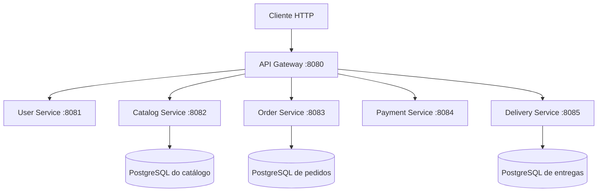
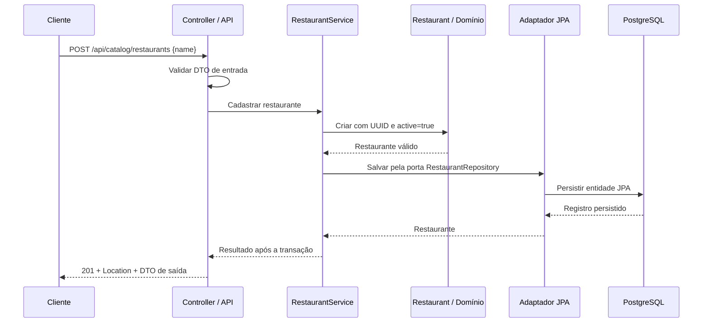

# Arquitetura do Delivery Order System

## Implementado nesta etapa

Monorepo com seis aplicações Spring Boot executadas separadamente. Cada aplicação tem seu próprio build Maven, configuração e testes. Nenhum serviço depende do código Java de outro serviço.

O Catalog Service cadastra e consulta restaurantes em seu próprio PostgreSQL, incluindo a localização de coleta opcional. Essa localização também pode ser atualizada por uma operação própria. O Order Service cria, consulta, confirma e cancela pedidos em outro PostgreSQL. Delivery persiste entregas e entregadores em banco próprio, mas ainda não tem API de negócio. Usuários e pagamentos mantêm a base inicial, com endpoints de demonstração e Actuator.

O Gateway utiliza Spring Cloud Gateway Server WebFlux. Os cinco serviços utilizam Spring MVC. As rotas são estáticas e apontam para `localhost`, pois as aplicações são executadas diretamente na máquina nesta etapa. O Compose sobe os bancos de catálogo, pedidos e entregas, com volumes separados.

## Responsabilidades e contratos

As responsabilidades abaixo definem os limites de cada aplicação. O catálogo implementa cadastro, consultas e atualização da localização de coleta de restaurantes. Cardápios, produtos, preços e disponibilidade continuam planejados.

| Aplicação | Responsabilidade | Porta | Rota pelo Gateway | Pacote-base |
| --- | --- | --- | --- | --- |
| API Gateway | Encaminhar chamadas HTTP, sem regras de negócio | 8080 | — | `com.victhor.delivery.gateway` |
| User Service | Perfis de usuários e endereços | 8081 | `/api/users/**` | `com.victhor.delivery.user` |
| Catalog Service | Restaurantes, cardápios, produtos, preços e disponibilidade | 8082 | `/api/catalog/**` | `com.victhor.delivery.catalog` |
| Order Service | Pedidos, itens, totais, estados e coordenação da compra | 8083 | `/api/orders/**` | `com.victhor.delivery.order` |
| Payment Service | Tentativas de pagamento, aprovação, recusa e estorno | 8084 | `/api/payments/**` | `com.victhor.delivery.payment` |
| Delivery Service | Atribuição de entregador, coleta e estados da entrega | 8085 | `/api/deliveries/**` | `com.victhor.delivery.delivery` |

Cada serviço mantém `GET /api/{recurso}/ping`, respondendo HTTP 200 com `{"service":"<nome-do-serviço>","status":"ok"}`. O Gateway encaminha o caminho completo, sem remover prefixos. A rota `/api/catalog/**` atende também `/api/catalog/restaurants` e suas consultas, sem regras de negócio no Gateway.

Todas as aplicações mantêm `/actuator/health` e `/actuator/info`. O health do Gateway mede sua própria saúde; a disponibilidade dos serviços precisa ser verificada separadamente. Catálogo, pedidos e entregas incluem a saúde dos respectivos bancos em seus endpoints.

## Organização do catálogo

A classe `CatalogServiceApplication` permanece no pacote-base para a descoberta dos componentes Spring. A separação de responsabilidades agora acompanha o primeiro caso de uso:

| Pacote | Responsabilidade |
| --- | --- |
| `api` | Controllers, DTOs de entrada e saída, validação HTTP, paginação recebida e respostas de erro |
| `application` | `RestaurantService` coordena os casos de uso; `RestaurantRepository` define a porta de persistência e `RestaurantPage` representa uma página, sem dependências de Spring ou JPA |
| `domain` | `Restaurant` representa UUID, nome, estado ativo e localização opcional; `PickupLocation` valida latitude e longitude, sem depender de HTTP, Spring ou JPA |
| `infrastructure.persistence` | Entidade JPA, repositório Spring Data e adaptador que implementa a porta, delimita as transações e converte entre o modelo de domínio e o de persistência |

O domínio não contém anotações JPA ou de validação HTTP. A entidade JPA não é exposta na API. DTOs controlam o contrato público, e o adaptador concentra o mapeamento de persistência. Não há um framework genérico de casos de uso ou repositórios: uma porta específica do restaurante é suficiente.

`RestaurantConfiguration`, em `infrastructure`, fornece o serviço de aplicação como bean Spring e injeta o adaptador. `JpaRestaurantRepository` abre transações de escrita no cadastro e na atualização de localização, e transações de leitura nas consultas. Cada operação retorna depois da confirmação da transação. Um fluxo futuro com várias gravações relacionadas precisará de uma transação que englobe a operação inteira.

Usuários e pagamentos continuam com a classe `*Application` no pacote-base e controllers em `api`. Novas camadas serão criadas quando houver código que as justifique. O Gateway mantém organização própria para configuração e filtros.

## Domínio de entregas

O pacote `domain` de Delivery contém `Delivery`, `DeliveryStatus`, `DeliveryLocation`, `GeoPoint` e a identidade mínima de `Courier`. Não depende de Spring, HTTP, JPA ou código de outros serviços. `Delivery` encapsula suas alterações em comandos; origem e destino são valores imutáveis.

O ciclo é `CREATED → ASSIGNED → PICKED_UP → IN_TRANSIT → DELIVERED`, com cancelamento apenas antes da coleta. A chegada é um evento durante `IN_TRANSIT` e precisa ser registrada antes da conclusão. Os comandos recebem `Instant`, rejeitam horários anteriores ao último evento e preservam os dados quando uma validação falha. Comandos repetidos e alterações em estados terminais são rejeitados.

A atribuição exige um entregador ativo, carregado do banco pelo adaptador. Um índice único parcial impede duas entregas em andamento para o mesmo entregador, e outra restrição garante uma entrega por pedido. `@Version` protege atualizações da mesma entrega. O [documento do domínio](delivery-domain.md) detalha as regras; a [documentação de persistência](delivery-persistence.md) explica schema, transações e testes.

As portas de repositório ficam em `application`, e as entidades e adaptadores em `infrastructure.persistence`. Cada transição lê a entidade, reconstrói o domínio com `Delivery.restore`, aplica o comando e grava o estado na mesma transação. O domínio permanece independente de JPA. A API de negócio será implementada depois, incluindo a tradução de conflitos de persistência para respostas HTTP.

## Pedidos

O pedido contém UUID, referência ao restaurante, endereço e coordenadas de destino, estado e horários do ciclo de vida. O destino é uma cópia imutável: uma mudança futura no endereço de um usuário não altera um pedido já criado. `CREATED` pode passar para `CONFIRMED` ou `CANCELLED`; `CONFIRMED` pode passar para `CANCELLED`. Um cancelamento impede nova confirmação. Confirmar ou cancelar novamente mantém o resultado anterior.

`Order` e `DeliveryDestination`, em `domain`, validam os dados e as transições sem depender de Spring, JPA ou HTTP. `OrderService`, em `application`, coordena as operações por uma porta de persistência e recebe um `Clock` para gerar horários testáveis. O controller converte DTOs em dados do domínio; o adaptador JPA lê o pedido, aplica sua transição e salva o estado na mesma transação. A resposta usa um DTO e só retorna após a confirmação da transação.

`OrderEntity` usa `@Version` para impedir que uma escrita baseada em uma versão antiga sobrescreva outra alteração. A API traduz esse conflito para `409`; o cliente deve consultar o estado atual. Não há repetição automática da transação. A migration também impõe limites de coordenadas, estados permitidos e consistência dos timestamps.

A API oferece cadastro, consulta por UUID, confirmação e cancelamento em `/api/orders`. O Gateway já encaminha esse prefixo. Timestamps são instantes UTC com precisão de microssegundos, compatível com PostgreSQL. Erros seguem `ProblemDetail`, como no catálogo: entrada inválida `400`, pedido inexistente `404`, conflito `409` e falha inesperada `500` sem detalhes internos.

Nesta etapa, `restaurantId` é uma referência, sem consulta remota ou chave estrangeira no catálogo. Não há validação de restaurante ativo, itens, preços, pagamento ou criação de entrega. A confirmação é uma ação explícita da API. Ao integrar Delivery, será necessário coordenar o cancelamento com o estado da entrega. Os [exemplos de pedidos](orders.md) detalham o contrato e essas limitações.

As operações com JPA são síncronas. Não há trabalho independente que justifique `@Async` ou mensageria neste fluxo: a resposta confirma que a transação terminou. Processamento assíncrono entre serviços será avaliado junto com idempotência e entrega durável de eventos.

## Fluxo de cadastro e consulta

O controller recebe o JSON, valida a entrada e chama o caso de uso. O serviço de aplicação cria o restaurante por meio do domínio e solicita sua persistência. O domínio remove espaços nas extremidades do nome, exige um nome não vazio de até 120 caracteres e gera o UUID com `active=true` para um cadastro. O adaptador converte o restaurante para a entidade JPA e salva no PostgreSQL. Ao retornar, o controller monta o DTO com `id`, `name`, `active` e `pickupLocation`, status `201` e `Location: /api/catalog/restaurants/{id}`. O endereço relativo funciona tanto pela porta 8082 quanto pelo Gateway na porta 8080.

Na consulta por UUID, o controller converte o identificador e o caso de uso busca pela mesma porta de persistência. Um resultado vira DTO com `200`; a ausência vira erro `404`. UUID malformado é entrada inválida (`400`).

Na listagem, a API valida `page` e `size`, o caso de uso solicita a página, e o adaptador executa a consulta e a contagem. A resposta contém `content`, `page`, `size`, `totalElements` e `totalPages`, sem expor a representação interna de paginação do Spring Data.

## Contrato de restaurantes

| Operação | Entrada | Resposta de sucesso |
| --- | --- | --- |
| `POST /api/catalog/restaurants` | JSON com `name` obrigatório e `pickupLocation` opcional | `201`, `Location` e `{id, name, active, pickupLocation}` |
| `GET /api/catalog/restaurants/{id}` | UUID | `200` e `{id, name, active, pickupLocation}` |
| `GET /api/catalog/restaurants?page=0&size=20` | Página e tamanho opcionais | `200` e `{content, page, size, totalElements, totalPages}` |
| `PUT /api/catalog/restaurants/{id}/pickup-location` | UUID e JSON com `latitude` e `longitude` | `200` com o restaurante atualizado |

`page` começa em zero e deve ser não negativo. `size` fica entre 1 e 100, com padrão 20. O produto `page * size` deve caber no offset do JPA (máximo `2147483647`). A ordenação é fixa por nome ascendente e UUID ascendente como desempate; nomes repetidos são permitidos. Uma página sem registros possui `content` vazio. A ordenação é determinística para o mesmo conjunto de dados; alterações concorrentes podem mudar o conteúdo de páginas consultadas em momentos diferentes.

A localização pode ser informada ou substituída; nome e estado ativo não têm operação de atualização nesta etapa. Também não há exclusão, desativação ou remoção da localização. O cliente não escolhe o UUID nem o estado inicial do cadastro.

`PickupLocation` exige latitude e longitude finitas, nos intervalos inclusivos [-90, 90] e [-180, 180]. A API usa DTOs próprios e rejeita coordenadas ausentes ou recebidas como strings. Restaurantes antigos continuam sem localização, representada por `null`. O `PUT` altera as duas coordenadas na mesma transação, preserva os outros campos e retorna `404` quando o restaurante não existe.

Os erros HTTP são padronizados como `ProblemDetail`, com tipo de mídia `application/problem+json` e campos `status`, `title` e `detail`. Podem incluir `type` e `instance`. Entrada inválida, JSON malformado, UUID inválido ou paginação inválida retornam `400`; restaurante inexistente retorna `404`. Falhas inesperadas retornam `500` com mensagem genérica, sem SQL, stack trace ou outras informações internas.

## Persistência e execução local

O catálogo usa Spring Data JPA e driver PostgreSQL. Flyway controla a evolução do schema em `services/catalog-service/src/main/resources/db/migration`; a migration inicial cria a tabela de restaurantes com UUID, nome obrigatório e indicador ativo. O índice por `(name, id)` acompanha a ordem de consulta. As versões das dependências são geridas pelo Spring Boot 4.1.1 existente, incluindo o starter Flyway e o módulo PostgreSQL do Flyway.

A V2 adiciona as duas coordenadas como colunas opcionais, com constraints para exigir o par completo e respeitar os limites geográficos. Ela não altera a V1 nem preenche localizações nos registros existentes. Um teste com PostgreSQL migra dados da V1 para a V2 e confere essa preservação.

Na inicialização, Flyway aplica as migrations pendentes e Hibernate valida o mapeamento com `spring.jpa.hibernate.ddl-auto=validate`. Não há criação ou atualização automática do schema pelo Hibernate. `spring.jpa.open-in-view=false` mantém o acesso ao banco dentro da camada de aplicação/persistência, antes da montagem da resposta HTTP.

`compose.yaml` contém `catalog-db`, `order-db` e `delivery-db`, com imagem `postgres:17-alpine` e health check `pg_isready`. O catálogo usa banco `catalog`, volume `catalog_postgres_data` e porta padrão 5432. Pedidos usam banco `orders`, volume `order_postgres_data` e porta padrão 5434. Entregas usam banco `deliveries`, volume `delivery_postgres_data` e porta padrão 5435. As portas são publicadas em `127.0.0.1`. As aplicações Java continuam executadas na máquina, fora do Compose.

`.env.example` documenta `CATALOG_DB_URL`, `CATALOG_DB_USERNAME`, `CATALOG_DB_PASSWORD` e `CATALOG_DB_PORT`, com valores apenas locais. A cópia `.env` não é versionada. A senha é obrigatória; o Spring importa o arquivo do diretório de execução, e o comando de desenvolvimento no README fixa esse diretório na raiz. Variáveis de ambiente também podem fornecer a configuração. Se a porta estiver ocupada, `CATALOG_DB_PORT` e a porta da URL JDBC devem ser ajustadas juntas.

Dados do volume sobrevivem a reinícios. Credenciais definidas pelo container inicializam um banco vazio, mas não reconfiguram um volume já existente. Execução e testes não exigem remover volumes ou dados locais. Cada serviço continuará sendo dono de seus dados; serviços não consultarão tabelas de outros serviços.

Pedidos seguem o mesmo processo de configuração, com `ORDER_DB_URL`, `ORDER_DB_USERNAME`, `ORDER_DB_PASSWORD` e `ORDER_DB_PORT`. A migration `V1__create_orders.sql` pertence ao Order Service; Flyway gerencia seu schema e Hibernate apenas valida. A senha de pedidos não é exigida ao subir apenas o catálogo; para inicializar `order-db`, ela precisa estar definida, pois PostgreSQL rejeita senha vazia.

## Testes e validação

Os testes do domínio verificam as invariantes do restaurante sem subir Spring ou banco. Os testes de integração do catálogo usam PostgreSQL 17 real via Testcontainers, com configuração dinâmica e banco isolado do Compose. Eles inicializam o contexto, aplicam as migrations Flyway, validam o schema com Hibernate e cobrem HTTP e persistência: cadastro, UUID/estado inicial, nome, dados salvos, consulta, paginação, entrada inválida e restaurante inexistente. Pings e Actuator permanecem cobertos no catálogo.

O contexto do catálogo usa a mesma estratégia de banco descartável. A suíte completa exige Docker em execução e não ignora silenciosamente a integração quando ele está ausente. Pedidos também usam Testcontainers para testar cadastro, consulta, transições, erros, constraints do schema e duas transações que tentam alterar a mesma versão. Usuários, pagamentos, entregas e Gateway mantêm testes de inicialização de contexto.

`clean test` executa os testes; `clean verify` também gera o JAR executável. Além da suíte do catálogo, a verificação local exercita criação e consultas nas portas 8082 e 8080, conferindo `201`, `Location`, `200`, pings e saúde. O teste HTTP direto do catálogo não substitui a validação do encaminhamento pelo processo real do Gateway.

Os comandos de configuração, execução, testes e chamadas HTTP estão no [README](../README.md).

Delivery testa seu domínio sem banco: transições, chegada antes da conclusão, cancelamento, entregador inativo, coordenadas e horários. Comandos inválidos precisam preservar todos os campos. Os testes de persistência e contexto usam PostgreSQL via Testcontainers; verificam também constraints, conflitos de versão e disputas entre transações pela mesma entrega ou entregador.

## Próximas etapas

O próximo passo é adicionar casos de uso e API ao ciclo de entregas. Java continua responsável pelas transações; o futuro serviço Python vai prever tempos por trecho e calcular rotas. O [plano de Route Intelligence](route-intelligence.md), o [contrato HTTP](route-intelligence-contract.md), o [plano de dados](route-intelligence-data.md) e o [roadmap](roadmap.md) descrevem essa evolução.

A demonstração com os serviços em containers usará hostnames da rede Docker e preservará os volumes existentes. Mensageria, outbox e compensações serão avaliadas quando o fluxo precisar dessas garantias. Produtos, pagamentos, autenticação, múltiplas entregas e cloud terão etapas próprias.
