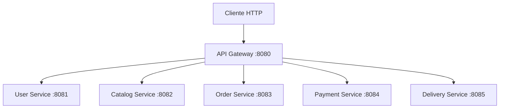

# Arquitetura do Delivery Order System

## Implementado nesta etapa

Monorepo com seis aplicações Spring Boot executadas separadamente. Cada aplicação tem seu próprio build Maven, configuração e teste de inicialização. Nenhum serviço depende do código Java de outro serviço.



O Gateway utiliza Spring Cloud Gateway Server WebFlux. Os cinco serviços utilizam Spring MVC. As rotas são estáticas e apontam para `localhost`, pois as aplicações são executadas diretamente na máquina nesta etapa.

## Responsabilidades e contratos

As responsabilidades de negócio abaixo definem os limites planejados; por enquanto, os serviços implementam somente um endpoint de demonstração e os endpoints do Actuator.

| Aplicação | Responsabilidade | Porta | Rota pelo Gateway | Pacote-base |
| --- | --- | --- | --- | --- |
| API Gateway | Encaminhar chamadas HTTP, sem regras de negócio | 8080 | — | `com.victhor.delivery.gateway` |
| User Service | Perfis de usuários e endereços | 8081 | `/api/users/**` | `com.victhor.delivery.user` |
| Catalog Service | Restaurantes, cardápios, produtos, preços e disponibilidade | 8082 | `/api/catalog/**` | `com.victhor.delivery.catalog` |
| Order Service | Pedidos, itens, totais, estados e coordenação da compra | 8083 | `/api/orders/**` | `com.victhor.delivery.order` |
| Payment Service | Tentativas de pagamento, aprovação, recusa e estorno | 8084 | `/api/payments/**` | `com.victhor.delivery.payment` |
| Delivery Service | Atribuição de entregador, coleta e estados da entrega | 8085 | `/api/deliveries/**` | `com.victhor.delivery.delivery` |

Cada serviço recebe `GET /api/{recurso}/ping` e responde HTTP 200 com `{"service":"<nome-do-serviço>","status":"ok"}`. O Gateway encaminha o caminho completo, sem remover prefixos. Por exemplo, `/api/orders/ping` continua igual ao chegar no Order Service.

O Gateway não possui controller de negócio. Seu `/actuator/health` mede somente sua própria saúde; a disponibilidade dos serviços precisa ser verificada separadamente.

## Organização interna

A classe `*Application` fica no pacote-base; os controllers ficam no subpacote `api`. Os testes de contexto ficam no mesmo pacote-base da aplicação. Isso mantém os componentes dentro da área de descoberta padrão do Spring.

Exemplo atual do Order Service:

```text
com.victhor.delivery.order
├── OrderServiceApplication.java
└── api/
    └── OrderPingController.java
```

Conforme surgirem casos de uso, adotaremos as seguintes responsabilidades:

- `api`: controllers, DTOs e validação de entrada HTTP.
- `application`: casos de uso e portas necessárias para integrações.
- `domain`: entidades, estados e regras de negócio, independentes de HTTP e persistência.
- `infrastructure`: implementações de persistência, mensageria e clientes externos.

Essas divisões serão criadas quando houver código que as justifique. O Gateway terá organização própria para configuração e filtros, sem reproduzir camadas de domínio dos serviços.

## Planejado, ainda não implementado

- PostgreSQL e migrations Flyway, com cada serviço sendo dono dos seus dados e credenciais. Serviços não consultarão tabelas de outros serviços.
- RabbitMQ para comandos e eventos entre aplicações. Cada serviço acessará diretamente seu banco; o broker não ficará entre aplicação e banco.
- Order Service coordenando o fluxo de compra e compensações. Os contratos e estados serão definidos antes de implementar a saga.
- Transactional Outbox, consumidores idempotentes, confirmações, retentativas limitadas e DLQ para recuperação de falhas de mensageria.
- Autenticação e autorização, com decisão sobre provedor de identidade em etapa própria.
- Docker Compose para execução local do conjunto. Nesse ambiente, os endereços dos serviços terão de usar os nomes da rede Docker em vez de `localhost`.
- Testcontainers para testes com PostgreSQL e RabbitMQ reais e testes dos fluxos de negócio.

## Validação

Cada aplicação possui um teste `contextLoads`. A mudança de pacotes deve ser validada com `clean test`, removendo classes compiladas nos caminhos antigos. `clean verify` também gera o JAR executável.

Além dos testes, conferir HTTP 200 e o conteúdo esperado dos cinco pings, diretamente e pelo Gateway, e `UP` nos seis endpoints de saúde. Um `404` não valida um ping implementado.

Os comandos reproduzíveis de execução e verificação estão no [README](../README.md).
