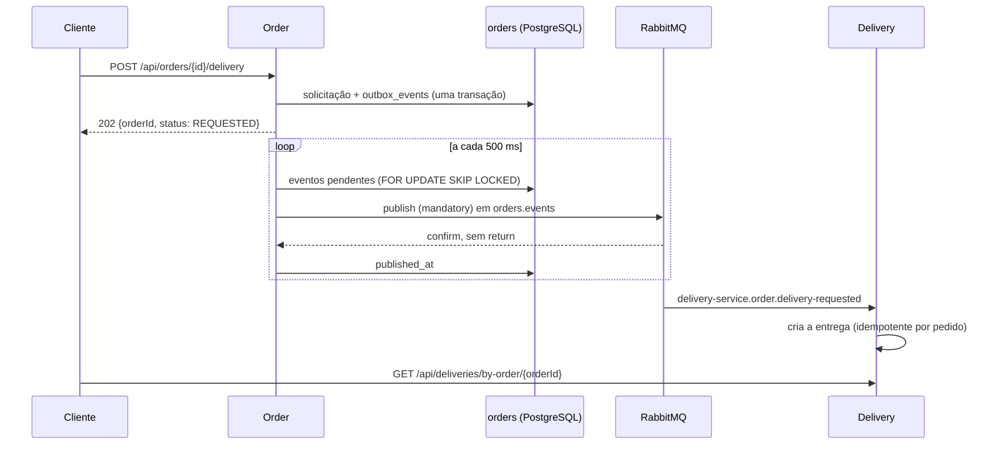

# Solicitação de entrega por RabbitMQ

Order não chama mais o Delivery por HTTP para criar a entrega. Ao receber `POST /api/orders/{id}/delivery`, grava a solicitação e um evento na mesma transação, responde `202 Accepted` e publica o evento depois, pelo RabbitMQ. O Delivery consome o evento e cria a entrega. O pedido continua aceito mesmo com o Delivery ou o broker fora do ar, e nada se perde no caminho: o evento fica no banco do Order até o broker confirmar que o recebeu e o roteou.

## Fluxo



1. Order exige pedido `CONFIRMED` do próprio cliente e, na primeira solicitação, restaurante ativo com coleta, como antes.
2. Na mesma transação, marca `deliveryRequestedAt`, grava os snapshots em `order_delivery_requests` e o evento em `outbox_events` (V6). Se a transação falhar, não sobra evento sem solicitação nem solicitação sem evento.
3. A resposta é `202` com `{"orderId": "...", "status": "REQUESTED"}`. Repetir a chamada devolve a mesma resposta, sem consultar o catálogo nem gravar outro evento.
4. O publicador lê os eventos pendentes em ordem de criação e publica cada um com `publisher confirms` e `mandatory`. Só marca `published_at` depois de um `ack` sem `return`. `nack`, timeout de 5 segundos ou ausência de fila para o evento mantêm o evento pendente, incrementam `attempts` e interrompem o lote, para que um evento posterior não passe na frente.
5. O Delivery cria a entrega com `INSERT ... ON CONFLICT (order_id) DO NOTHING` e grava o cliente do evento em `deliveries.customer_id` (V4). Um evento repetido devolve a entrega existente.

A entrega aparece em `GET /api/deliveries/by-order/{orderId}` alguns instantes depois; até lá a consulta responde `404`. A [interface web](frontend-deliveries.md) consulta a cada segundo enquanto espera.

## Contrato do evento

| Item | Valor |
| --- | --- |
| Exchange | `orders.events` (topic, durável), declarado pelo Order |
| Routing key | `order.delivery-requested` |
| `type` | `order.delivery-requested.v1` |
| `message_id` | igual a `eventId` |
| Headers | `X-Request-Id` da requisição que originou o evento |
| Entrega | persistente, `application/json`, UTF-8 |

```json
{
  "eventId": "5b0f0d7e-2a3e-4f1c-9c1e-6a1c1e0b2d11",
  "orderId": "9bc64ab1-8cca-4bd2-9eca-727d6a7074d2",
  "customerId": "1bc4a6a0-2500-4f61-aaf0-2330df05cc26",
  "origin": { "description": "Restaurante Central", "latitude": -23.55, "longitude": -46.63 },
  "destination": { "description": "Rua Central, 42", "latitude": -23.56, "longitude": -46.64 },
  "requestedAt": "2026-10-09T05:59:12.123456Z"
}
```

Uma mudança incompatível no corpo exige outro `type` (`...v2`). O consumidor recusa tipos que não conhece.

## Consumo, retry e DLQ

O Delivery declara a fila `delivery-service.order.delivery-requested` (quorum, durável), ligada a `orders.events`, e a fila de mensagens mortas `delivery-service.order.delivery-requested.dlq`, pelo exchange `delivery-service.dead-letter`. Cada serviço declara o que consome; declarar de novo com os mesmos argumentos não altera nada.

| Situação | Resultado |
| --- | --- |
| Evento válido, pedido sem entrega | Entrega `CREATED`; métrica `outcome=created` |
| Mesmo pedido, mesmos snapshots e cliente | Entrega existente, mesmo depois de cancelada ou concluída; `outcome=duplicate` |
| Entrega anterior ao evento, sem cliente | Recebe o cliente do evento; `outcome=duplicate` |
| JSON inválido, campo ausente, UUID não canônico, coordenada fora do limite ou `type` desconhecido | DLQ sem retry; `outcome=invalid` |
| Mesmo pedido com outra origem, outro destino ou outro cliente | DLQ sem retry; a entrega guardada não muda; `outcome=conflict` |
| Falha transitória (banco indisponível, por exemplo) | Até 3 novas tentativas, de 1 s dobrando até 10 s; depois, DLQ |

Repetir não corrige um evento inválido ou conflitante, então esses casos vão direto para a DLQ. O consumidor e o recoverer registram `eventId`, `orderId`, resultado e motivo, nunca o corpo, que contém endereços. O `X-Request-Id` do evento entra no MDC durante o consumo, então a criação aparece nos logs com o mesmo identificador da requisição que a solicitou.

Para inspecionar a DLQ, abra a interface de gerenciamento em `http://localhost:15672` (somente `127.0.0.1`), com o usuário e a senha do `.env`. Em **Queues**, `...dlq` mostra as mensagens e permite lê-las ou movê-las. Não há reprocessamento automático da DLQ.

## Métricas

| Métrica | Onde | O que mede |
| --- | --- | --- |
| `order.outbox.published` | Order | Eventos publicados e confirmados, por `type` |
| `order.outbox.failed` | Order | Tentativas sem confirmação ou sem rota, por `type` |
| `order.outbox.pending` | Order | Eventos ainda não publicados (gauge consultado no banco) |
| `delivery.requests.consumed` | Delivery | Eventos consumidos por `outcome`: `created`, `duplicate`, `invalid` ou `conflict` |

Um `order.outbox.pending` que só cresce indica broker fora do ar ou fila não declarada; a DLQ com mensagens indica eventos recusados pelo Delivery.

## Configuração

| Variável | Uso |
| --- | --- |
| `RABBITMQ_USERNAME` / `RABBITMQ_PASSWORD` | Credenciais do broker. A senha é obrigatória e fica só no `.env` |
| `RABBITMQ_HOST` / `RABBITMQ_PORT` | `localhost:5672` na execução nativa; `rabbitmq` no Compose |
| `RABBITMQ_MANAGEMENT_PORT` | Interface de gerenciamento, padrão `15672`, publicada só em `127.0.0.1` |
| `ORDER_OUTBOX_POLL_INTERVAL` | Intervalo entre leituras do outbox, padrão `500ms` |

Um `.env` anterior precisa das entradas `RABBITMQ_*` do `.env.example`, com uma senha própria. O Compose inicia `rabbitmq` (`rabbitmq:4.1-management-alpine`) junto com os bancos, com volume `rabbitmq_data` e `hostname` fixo: o nome do nó faz parte do diretório de dados, e um nome novo a cada recriação deixaria filas e mensagens para trás. Order e Delivery aguardam o broker saudável. O Order também espera o Delivery, que declara a fila ao iniciar. Se a fila ainda não existir, os eventos só ficam pendentes.

O Order não usa mais `DELIVERY_SERVICE_URL`; o Gateway continua usando essa variável para encaminhar `/api/deliveries/**`.

## Limites

- Entrega pelo menos uma vez: um evento pode chegar duplicado (por exemplo, se o Order cair entre o `ack` e a gravação de `published_at`). A criação idempotente por pedido absorve a repetição.
- A ordem só é garantida entre eventos do mesmo publicador; com várias instâncias do Order, o `SKIP LOCKED` evita publicação dupla, mas não ordena entre instâncias.
- Não há evento de volta do Delivery para o Order. O pedido não acompanha o estado da entrega; a interface consulta o Delivery.
- Eventos publicados permanecem em `outbox_events`; não há limpeza periódica.
- Um único usuário do broker atende Order e Delivery, sem permissões separadas por serviço.
- O cadastro manual `POST /api/deliveries` continua para a demonstração e não grava cliente.

## Validação

Em 09/10/2026, no Ubuntu:

- Delivery: `./mvnw -B verify`, 303 testes, sem falhas. `DeliveryRequestedMessagingTests` usa RabbitMQ 4.1 e PostgreSQL 17 via Testcontainers. Cobre criação com cliente e request id, repetição, quatro formatos inválidos e dois conflitos indo para a DLQ com uma única tentativa, e adoção do cliente por uma entrega anterior. O repositório cobre idempotência, conflito e criação concorrente.
- Order: `./mvnw -B verify`, 369 testes, sem falhas. `OrderDeliveryIntegrationTests` usa RabbitMQ e PostgreSQL via Testcontainers. Cobre `202`, um único evento com snapshots, cliente e `X-Request-Id`, repetição sem novo evento, evento pendente enquanto não há fila (com `attempts` crescendo) e publicado assim que a fila aparece, ausência de evento quando o catálogo falha e disputa entre cancelamento e solicitação.
- Frontend: lint, `tsc -b` e 72 testes passando.
- Compose: `docker compose --profile demo up -d --build --wait` com 14 containers saudáveis e `pwsh -NoProfile -File scripts/smoke-route-demo.ps1 -CheckRecovery -CheckPersistence` passando. Com `-CheckRecovery`, o smoke para o RabbitMQ, recebe `202`, confirma que a entrega ainda não existe, religa o broker e encontra a entrega criada a partir do outbox. Também confirma que `PUT /api/deliveries/by-order/{orderId}` responde `405`.
