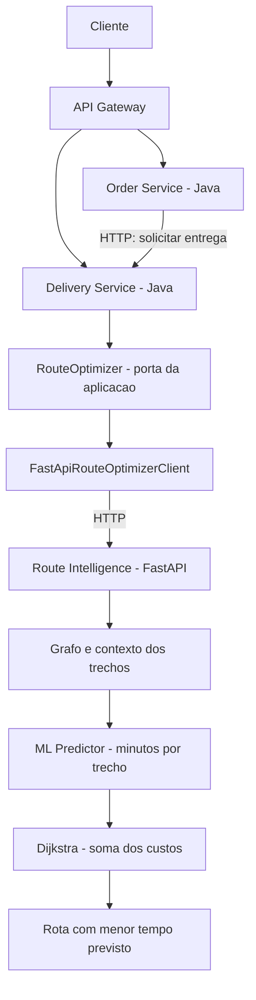

# Route Intelligence

Este documento descreve a evolução planejada do projeto. O catálogo já possui restaurantes e localização de coleta. Pedidos têm cadastro, consulta, confirmação e cancelamento. Delivery possui [regras de domínio testadas](delivery-domain.md), [persistência PostgreSQL](delivery-persistence.md) e [API HTTP do ciclo de entregas](delivery-lifecycle.md). O serviço Python será desenvolvido depois da integração entre pedidos e entregas.

## Objetivo

Escolher a rota com menor tempo previsto para uma entrega. Uma rota de 11 km em 19 minutos deve ser preferida a uma de 8 km em 31 minutos. A distância entra no cálculo e aparece na resposta, mas a escolha é feita pelo tempo.

Java/Spring Boot continua cuidando dos pedidos, das entregas e das transações. Python fica com a previsão de tempo e o cálculo do caminho. Vamos começar com uma entrega por vez para cada entregador, atribuição manual e deslocamento por motocicleta. O grafo sintético terá apenas vias permitidas para esse veículo.

Os primeiros dados de ruas e trânsito serão sintéticos. Mapas reais, múltiplas entregas, atribuição automática, MLOps e cloud ficam para etapas posteriores, descritas no [roadmap](roadmap.md). LLMs, RAG e agents não fazem parte dessa solução.

## Responsabilidades

| Componente | Responsabilidade |
| --- | --- |
| Catalog Service | Restaurante e localização de coleta |
| Order Service | Pedido, referência ao restaurante e destino |
| Delivery Service | Atribuição do entregador, coleta, transporte, estados e plano de rota |
| Route Intelligence | Previsão de tempo e cálculo do caminho |
| ML Predictor | Estimar quantos minutos cada trecho deve levar |
| Routing Engine | Encontrar o caminho com a menor soma desses tempos |

O modelo aprende a estimar o tempo dos trechos. Dijkstra usa essas estimativas para escolher o caminho; ele é um algoritmo de grafos, não Machine Learning. As regras da entrega continuam no Java.



O cliente acessa o sistema pelo Gateway. O Delivery chama o serviço Python internamente, sem expor uma nova rota pública no Gateway. Order e Delivery também começarão se comunicando por HTTP, com criação idempotente de entregas. Mensageria pode entrar quando precisarmos processar eventos de forma independente e garantir sua entrega.

## O que falta no backend

O catálogo já permite informar coordenadas no cadastro ou em uma atualização, sem serviço externo de geocodificação. Restaurantes sem localização continuam válidos no catálogo, mas precisarão desse dado antes de serem usados em uma entrega.

O pedido já possui UUID, `restaurantId`, destino, timestamps e os estados `CREATED`, `CONFIRMED` e `CANCELLED`. A confirmação é manual e não indica pagamento aprovado; produtos e cobrança ainda não foram implementados.

Somente um pedido confirmado poderá solicitar entrega. Antes da criação, a integração verificará se o restaurante está ativo e tem localização. Cancelar o pedido depois de solicitar uma entrega exige coordenação entre serviços; essa operação será rejeitada na primeira versão.

### Delivery

| Elemento | Dados propostos |
| --- | --- |
| `Delivery` | `id`, `orderId`, `origin`, `destination`, `courierId` opcional até a atribuição, `status` e versão para concorrência |
| `DeliveryLocation` | Descrição do local e `GeoPoint`, copiados para a entrega; não presume geocodificação |
| `GeoPoint` | Latitude finita entre -90 e 90 e longitude finita entre -180 e 180, em WGS84 |
| `Courier` | Identidade local mínima e indicador ativo; atribuição manual |
| `RoutePlan` | Origem/destino usados, partida planejada, instante da previsão, trechos ordenados, distância, tempo previsto e versões do modelo/grafo |
| `SegmentTraversal` | Passagem observada por um trecho; será adicionada na etapa de coleta de observações |

Cada serviço acessa apenas o próprio banco, sem chaves estrangeiras entre bancos. A entrega guarda uma cópia da origem e do destino. Assim, mudar o endereço de um restaurante ou pedido não altera uma entrega já criada.

Estados da entrega:

```text
CREATED -> ASSIGNED -> PICKED_UP -> IN_TRANSIT -> DELIVERED
CREATED -> CANCELLED
ASSIGNED -> CANCELLED
```

Regras iniciais:

- `orderId` é único no banco. Repetir a criação com os mesmos dados retorna a entrega existente; dados diferentes geram conflito.
- O entregador precisa estar ativo e sem outra entrega em andamento. O deslocamento só começa depois da coleta.
- Entregas concluídas ou canceladas não mudam mais de estado. O cancelamento só é permitido antes da coleta.
- Uma versão no registro detecta atualizações concorrentes e evita que uma requisição sobrescreva a outra.
- Os timestamps usam `Instant` em UTC: `createdAt`, `updatedAt`, `assignedAt`, `pickedUpAt`, `departedAt`, `arrivedAt`, `deliveredAt` e `cancelledAt`. Nos testes, o relógio é controlado.
- A chegada é registrada durante `IN_TRANSIT`. A conclusão exige chegada registrada e horários coerentes. Separar esses eventos permite distinguir tempo de trânsito de tempo de atendimento.

A organização segue o catálogo: domínio e aplicação em Java puro, DTOs em `api` e persistência e clientes HTTP em `infrastructure`. O serviço Python não acessa esses bancos nem altera estados da entrega.

## Grafo e escolha da rota

O primeiro grafo será pequeno, sintético e armazenado em JSON. Cada nó terá um identificador e coordenadas. Cada aresta representará um trecho dirigido, com `segment_id`, `from_node`, `to_node`, `distance_km`, `road_type` e `reference_speed_kmh`.

Distância e velocidade precisam ser finitas e positivas. Uma via de mão dupla terá duas arestas. Nesta versão, haverá no máximo uma aresta por par ordenado de nós.

As distâncias devem ser coerentes com as coordenadas do cenário, sem representar ruas reais. O arquivo terá `graph_version`, fuso `America/Sao_Paulo`, perfil de motocicleta e `data_origin: synthetic`. Alterar a geometria ou os atributos estáticos exige uma nova versão.

O tráfego virá de cenários sintéticos reproduzíveis, com valor, fonte e horário por trecho. Cada requisição calculará seu próprio `predicted_travel_time_minutes`, mantendo o grafo compartilhado inalterado.

Vamos começar com Dijkstra, usando lista de adjacência e `heapq` da biblioteca padrão. Isso atende ao grafo pequeno e aos custos positivos sem precisar de NetworkX. A* pode ser avaliado se o desempenho justificar a mudança; ele também exigiria uma heurística admissível de tempo. Usar distância diretamente não atenderia à unidade do custo. [Referência de Dijkstra](https://networkx.org/documentation/stable/reference/algorithms/generated/networkx.algorithms.shortest_paths.weighted.dijkstra_path.html).

Fluxo de uma consulta:

1. Validar entrada e associar as coordenadas aos nós do cenário.
2. Obter os atributos estáticos e o snapshot de contexto por trecho.
3. Prever em lote os custos de todas as arestas do grafo pequeno, sem uma chamada HTTP por aresta.
4. Rejeitar previsões não finitas ou não positivas com erro controlado.
5. Executar Dijkstra, reconstruir o caminho e somar tempos e distâncias sem arredondamentos intermediários.

Filtrar primeiro pelas menores distâncias poderia descartar a rota mais rápida. Por isso, a previsão cobre todas as arestas do grafo pequeno. Os cenários de teste devem variar o tráfego entre trechos: multiplicar todos os custos pelo mesmo fator não muda a escolha do caminho.

A primeira versão usa o contexto da partida planejada durante todo o cálculo. Ela não prevê mudanças no trânsito ao longo da viagem. Considerar o horário de chegada a cada trecho exigirá rever tanto o modelo quanto o algoritmo.

## Serviço Python

O serviço começa com `app/main.py`, dependências, testes e health check. A estrutura abaixo será criada aos poucos, conforme as funcionalidades entrarem:

```text
services/route-intelligence-service/
    app/
        main.py
        api/
        schemas/
        services/route_planner.py
        routing/graph.py
        routing/dijkstra.py
        ml/features.py
        ml/predictor.py
    training/
        generate_dataset.py
        train.py
        evaluate.py
    data/synthetic/
    artifacts/
    tests/
    requirements.txt
    Dockerfile
```

A base será Python 3.12+, FastAPI, Pydantic e pytest. NumPy, pandas, scikit-learn e joblib entram nas etapas de dados e modelo. As versões serão fixadas durante a implementação. PyTorch e TensorFlow não são necessários para os modelos previstos.

## Docker e execução

Hoje o Compose executa `catalog-db`, `order-db` e `delivery-db`, com volumes separados. A demonstração completa incluirá o Gateway e os serviços envolvidos na entrega, preservando os volumes existentes.

O endereço do serviço Python será configurável: `http://route-intelligence-service:8000` na rede Docker e `http://localhost:8000` ao executar na máquina. As URLs JDBC dentro dos containers também usarão o hostname do banco.

O serviço Python terá Dockerfile, dependências fixadas e health check. O treinamento será executado à parte, e a API receberá o artefato e seus metadados pela imagem ou por uma montagem somente de leitura. Credenciais reais e `.env` ficam fora do Git. Nenhuma dessas etapas exige apagar volumes.

## Comunicação e concorrência

A consulta de rota começa com uma chamada HTTP e resposta direta, com timeout. JPA mantém suas transações normais, sem `@Async` nesse fluxo. Treinamento roda offline.

Inferência e roteamento consomem CPU. Declarar uma função como `async def` não paraleliza esse trabalho; esse processamento deve ficar fora do event loop. Processos adicionais ou filas só entram se as medições indicarem necessidade. [Concorrência no FastAPI](https://fastapi.tiangolo.com/async/).

O Delivery chama Python fora da transação de banco. Ao salvar a resposta, abre uma transação curta e confere a versão e o estado da entrega. Se o cálculo falhar, a rota anterior e o estado da entrega são preservados.

Os testes e critérios de conclusão de cada etapa estão no [roadmap](roadmap.md). Os detalhes da integração e do modelo estão no [contrato HTTP](route-intelligence-contract.md) e no [plano de dados](route-intelligence-data.md).
